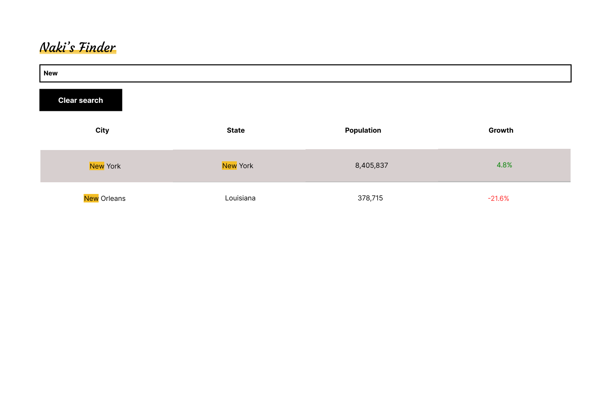

 <h2>Naki's Finder</h2>

A client app for searching US cities by city or state.

The app comprises of 4 components as seen on <a href='https://visionary-gnome-35f42a.netlify.app/'>storybook</a>

Check it out
<a href='https://stalwart-gaufre-57e664.netlify.app/'> Naki's Finder</a>

## Getting started

The client app requires Node.js 10.0+. Checkout the [docs](https://nodejs.org/en/) to see installation guidelines.

#### Installation guidelines

- Clone the repository
- On your command line, switch to the app root directory
- Install dependencies using `yarn install`
- Run development server using `yarn start:dev`
- Update production build using `yarn build`
- Run the production build using `yarn start:prod`

#### Wire Frame

